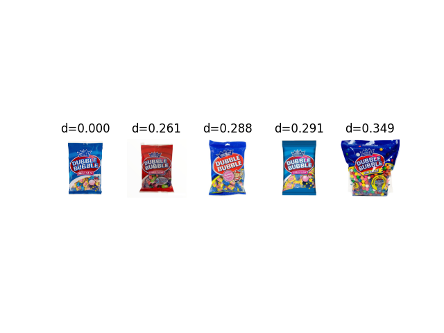

# Shelfhelp

This repository contains code for different experiments run and their test results in visual representation learning. Here are the list of things which will be elaborated further below.
1. Training SimCLR with ResNet50 as base model on custom dataset.
2. Randomly sampling few images to find its nearest matches from the test set.
3. Used lightly-ai, which is a computer vision framework for self-supervised learning, to train SwAV model on custom dataset and analyzed its performance.
4. Randomly selected 15 classes to understand the distribution of feature vectors on 2D plane using PCA
5. Created 7 top-level categories to understand if the products are forming clusters in 2D plane using PCA and t-SNE.

## About:
- As a part of my independent study for 2023, I worked with Shivendra Agrawal who is currently working towards developing a smartcane to help visually impaired and blind people to guide them in grocery shopping. 
- During my independent study, I trained SimCLR, SwAV models and analyzed their performance using PCA and t-SNE. In this process, I read research papers and blogs about SimCLR, SwAV, DINO, PaWS and identified that DINO and PAWS are the State of the art models for visual representation learning. I also explored a computer vision framework for self-supervised learning called lightly-ai which provides building blocks for all the SOTA models.

## Literature:
Papers:
- 
- 
- 
- 

Blogs:
- https://sh-tsang.medium.com/review-simclr-a-simple-framework-for-contrastive-learning-of-visual-representations-5de42ba0bc66
- https://uvadlc-notebooks.readthedocs.io/en/latest/tutorial_notebooks/tutorial17/SimCLR.html
- https://towardsdatascience.com/paper-explained-a-simple-framework-for-contrastive-learning-of-visual-representations-6a2a63bfa703
- https://ai.googleblog.com/2021/06/extending-contrastive-learning-to.html
- https://towardsdatascience.com/dino-emerging-properties-in-self-supervised-vision-transformers-summary-ab91df82cc3c
- https://ai.meta.com/blog/dino-paws-computer-vision-with-self-supervised-transformers-and-10x-more-efficient-training/

Videos:
- https://www.youtube.com/watch?v=h3ij3F3cPIk
- https://www.youtube.com/watch?v=wySLC4nszv8
- https://www.youtube.com/@PyTorchLightning

## Training SimCLR model on custom dataset:
- I cloned an existing github repository for SimCLR by sthalles - 
- Updated the code to train Simclr model on custom dataset as the existing code is designed to train models on CIFAR/STL10.
- Dataset: Custom grocery dataset has 15269 classes 

1. Experiments:
- To understand the working of SimCLR better, I started off with training the model on 200 random classes. Below, are the training loss curve and the accuracy curve are as below.

- Later, I finetuned the original pre-trained model with ResNet50 as base model. The accuracy curve for this is as below.

2. Testing:
- For model testing purposes, I randomly selected an image, computed its similarity with all other images, and then selected the top 5 closest matches. Here are some samples of the test results.

- Though, the results look quite promising in the above images. There are few cases where the model failed to identify similar images correctly. Here are some examples.

- The outcomes demonstrate that while the model doesn't provide identical products, it is capable of recognizing products with a similar appearance, such as bottles in the initial example.

3. Deductions:
- In our scenario, SimCLR is not yielding the desired outcomes, potentially due to the extensive number of classes, approximately 15,000, and the resemblances between various products depicted in these images.
- Observing that SimCLR successfully discerns product patterns, we could consider employing it to ascertain the broader category of a product. For instance, for a product like Cheerios, its higher-level category could be identified as cereals.

## Using PCA to plot samples on 2D plane:
Plotted feature vectors of samples from randomly sampled 15 classes in the dataset from SimCLR, SwAV and DINO using PCA. Below are the results.
PCA plot of test dataset with Simclr model with Resnet-50

PCA plot of test dataset with SwAV pretrained model

PCA plot of test dataset with DINO model

From, the above plot we can see that DINO is creating few clusters for classes. To further understand, I plotted the samples with DINO model using t-SNE visualization and below if the plot.

## Clustering of top-level categories with PCA and t-SNE:
- Given a scenario where the person is trying to identify in which section of the shop he/she is present, if we can find the top-level category of the products given the products present in the image it will be useful.
- To work the above scenario, I created 7 top-level categories namely bakery-items, canned-food, cereals, chips, sauce, condiments, soda. I manually added the products from the existing classes to top-level category classes.
- As DINO was performing the best in the before scenario, we demonstrated the formation of clusters using DINO on top-level category dataset.
- Here is the plot showing the same

## Future work:
- During my independent study, I completely worked on the custom dataset and used few images taken to check how the models are working in trying to find the match. But, I did not test variety of classes or different angles or used others perspective. I feel doing these would give robustness to our model.
- In top-level clustering of the products, I used images from the custom dataset. As an extention to this, we could test it in real time with images taken in real-time.
- I created only 7 top-level categories with no more than 10 images in each class. So, extending the dataset will help understand the working of the models better.
- Do research on how identifying top-level categories can help the person localize himself.
