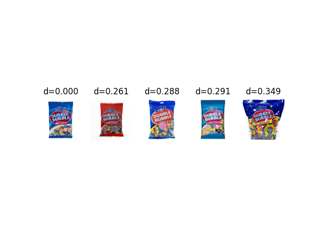
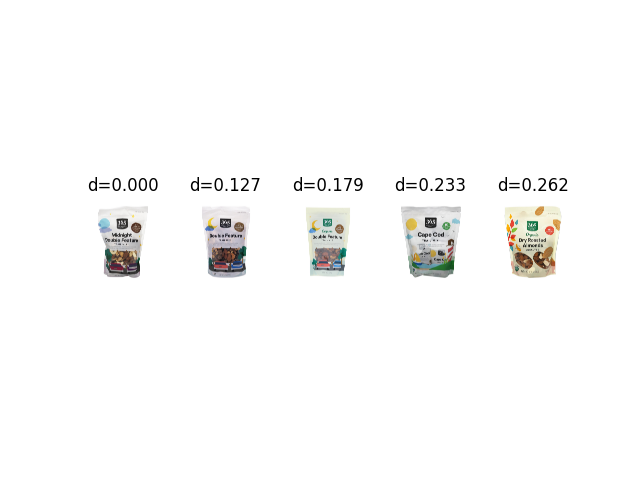
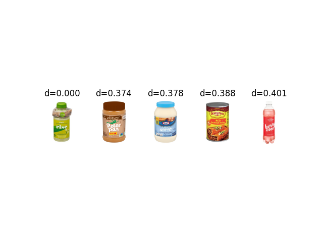

# Retraining SimCLR model on custom dataset
I cloned an existing github repository for SimCLR by sthalles - 

Updated the code to train Simclr model on custom dataset as the existing code is designed to train models on CIFAR/STL10.

### Dataset: Custom grocery dataset has 15269 classes 

## Experiments:
To understand the working of SimCLR better, I started off with training the model on 200 random classes. Below, are the training loss curve and the accuracy curve are as below.


Later, I finetuned the original pre-trained model with ResNet50 as base model. The accuracy curve for this is as below.


## Testing:

For model testing purposes, I randomly selected an image, computed its similarity with all other images, and then selected the top 5 closest matches. Here are some samples of the test results.




Though, the results look quite promising in the above images. There are few cases where the model failed to identify similar images correctly. Here are some examples.




The outcomes demonstrate that while the model doesn't provide identical products, it is capable of recognizing products with a similar appearance, such as bottles in the initial example.

## Deductions:
1. In our scenario, SimCLR is not yielding the desired outcomes, potentially due to the extensive number of classes, approximately 15,000, and the resemblances between various products depicted in these images.
2. Observing that SimCLR successfully discerns product patterns, we could consider employing it to ascertain the broader category of a product. For instance, for a product like Cheerios, its higher-level category could be identified as cereals.


------
## PyTorch SimCLR: A Simple Framework for Contrastive Learning of Visual Representations
[](https://zenodo.org/badge/latestdoi/241184407)


### Blog post with full documentation: [Exploring SimCLR: A Simple Framework for Contrastive Learning of Visual Representations](https://sthalles.github.io/simple-self-supervised-learning/)


### See also [PyTorch Implementation for BYOL - Bootstrap Your Own Latent: A New Approach to Self-Supervised Learning](https://github.com/sthalles/PyTorch-BYOL).

## Installation

```
$ conda env create --name simclr --file env.yml
$ conda activate simclr
$ python run.py
```

## Config file

Before running SimCLR, make sure you choose the correct running configurations. You can change the running configurations by passing keyword arguments to the ```run.py``` file.

```python

$ python run.py -data ./datasets --dataset-name stl10 --log-every-n-steps 100 --epochs 100 

```

If you want to run it on CPU (for debugging purposes) use the ```--disable-cuda``` option.

For 16-bit precision GPU training, there **NO** need to to install [NVIDIA apex](https://github.com/NVIDIA/apex). Just use the ```--fp16_precision``` flag and this implementation will use [Pytorch built in AMP training](https://pytorch.org/docs/stable/notes/amp_examples.html).

## Feature Evaluation

Feature evaluation is done using a linear model protocol. 

First, we learned features using SimCLR on the ```STL10 unsupervised``` set. Then, we train a linear classifier on top of the frozen features from SimCLR. The linear model is trained on features extracted from the ```STL10 train``` set and evaluated on the ```STL10 test``` set. 

Check the [](https://github.com/sthalles/SimCLR/blob/simclr-refactor/feature_eval/mini_batch_logistic_regression_evaluator.ipynb) notebook for reproducibility.

Note that SimCLR benefits from **longer training**.

| Linear Classification      | Dataset | Feature Extractor | Architecture                                                                    | Feature dimensionality | Projection Head dimensionality | Epochs | Top1 % |
|----------------------------|---------|-------------------|---------------------------------------------------------------------------------|------------------------|--------------------------------|--------|--------|
| Logistic Regression (Adam) | STL10   | SimCLR            | [ResNet-18](https://drive.google.com/open?id=14_nH2FkyKbt61cieQDiSbBVNP8-gtwgF) | 512                    | 128                            | 100    | 74.45  |
| Logistic Regression (Adam) | CIFAR10 | SimCLR            | [ResNet-18](https://drive.google.com/open?id=1lc2aoVtrAetGn0PnTkOyFzPCIucOJq7C) | 512                    | 128                            | 100    | 69.82  |
| Logistic Regression (Adam) | STL10   | SimCLR            | [ResNet-50](https://drive.google.com/open?id=1ByTKAUsdm_X7tLcii6oAEl5qFRqRMZSu) | 2048                   | 128                            | 50     | 70.075 |
